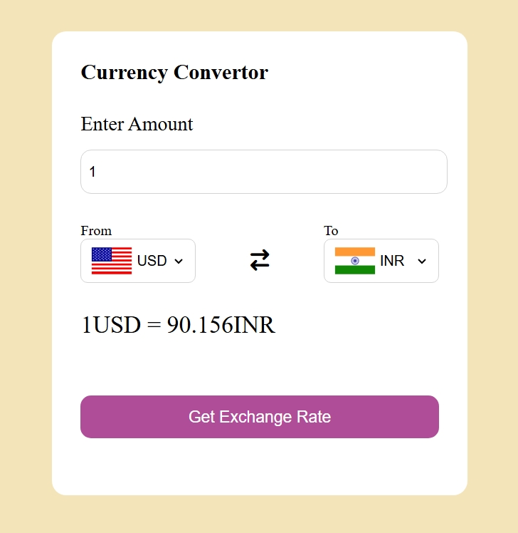

# Currency Converter 💱

A simple currency converter web app that converts currencies in real time using an exchange rate API.

## 🔹 Features
- Real-time currency conversion
- Supports multiple currencies
- User-friendly interface
- Responsive design

## 🔹 Technologies Used
- HTML
- CSS
- JavaScript
- Exchange Rate API

## 🔹 How to Run
1. Clone the repository
2. Open `index.html` in your browser

## 🔹 Live Demo
https://sanjaykmar45-git.github.io/Currency-Convertor/

## 🔹 Screenshot

